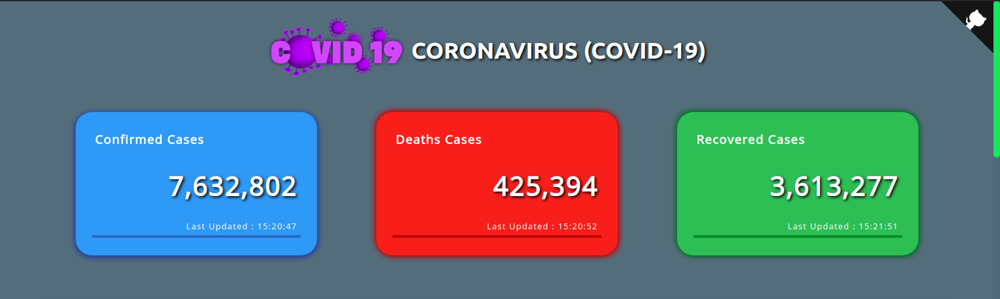
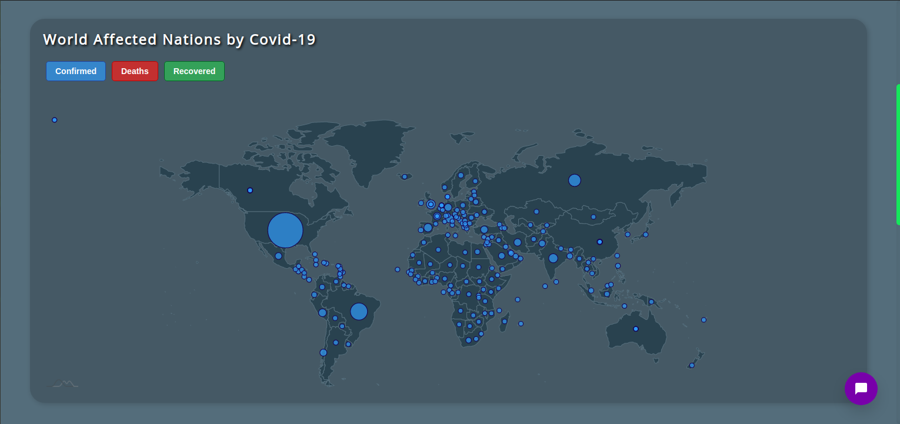
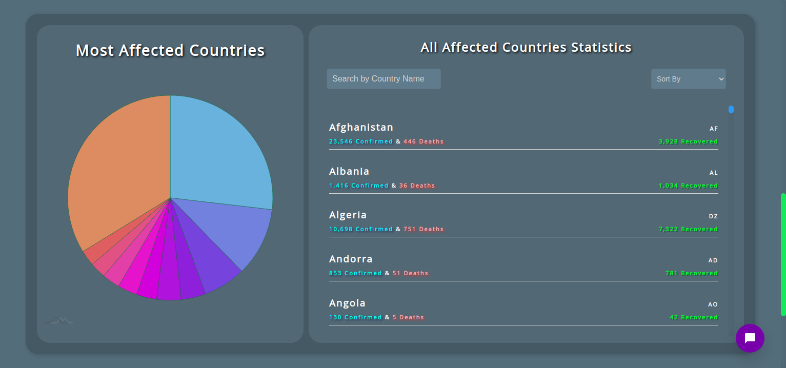
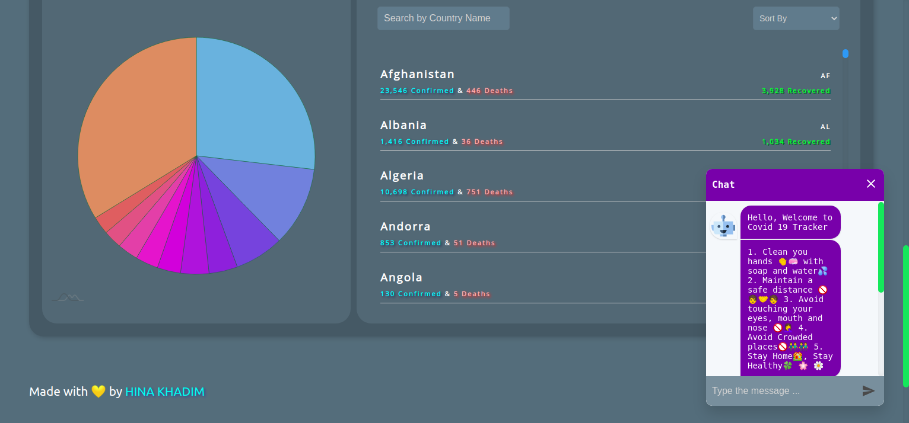
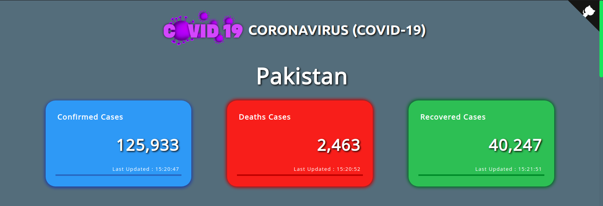
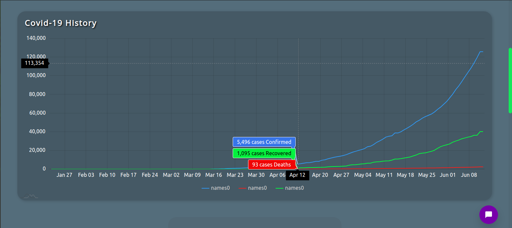
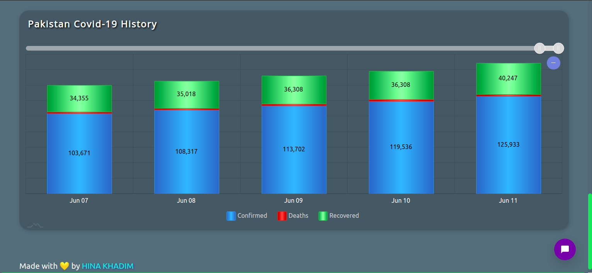

## 🌍🌍 COVID 19 TRACKER ✨ ⚡️

### ⚡️ [DEMO](https://covid19-tracker2002.netlify.app/)

### ⚡️ Screenshots

## ⚡️ API Used from [Coronavirus-Tracker-API](https://github.com/ExpDev07/coronavirus-tracker-api)

- https://coronavirus-tracker-api.herokuapp.com/all

## ⚡️ Made By

👩‍💻 HINA KHADIM 🇵🇰 🇵🇰 

- Github : [@Hina-softwareEngineer](https://github.com/Hina-softwareEngineer)
- LinkedIn : [@HinaKhadim](https://www.linkedin.com/in/hina-khadim-632845178/)
- Twitter [@hinakhadim_2002](https://twitter.com/hinaKhadim_2002)

### ⚡️ Give a Star ⭐️ 🌟 ⭐️ 🌟 if you liked it.

> If you want to contribute, feel free to make a Pull Request☘️ ☘️ .